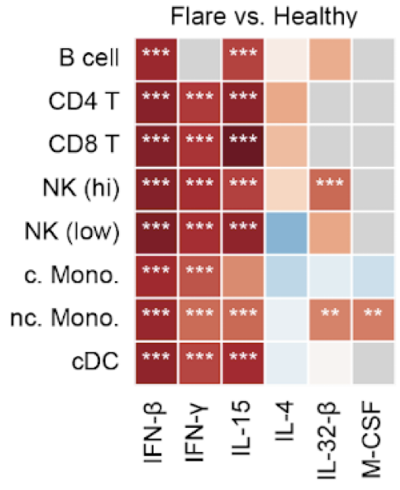
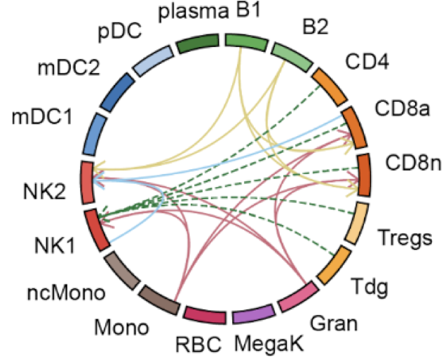

# huCIRA

[![Tests][badge-tests]][tests]
[![Documentation][badge-docs]][documentation]

[badge-tests]: https://img.shields.io/github/actions/workflow/status/theislab/cytokine_dict/test.yaml?branch=main
[badge-docs]: https://img.shields.io/readthedocs/cytokine_dict

huCIRA (human Cytokine Immune Response Analysis) provides an easy-to-use interface to analyze cytokine signaling and cytokine-induced immune program enrichment in transcriptomic datasets.

To get started, simply supply a transcriptomic dataset annotated with immune cell types and the experimental conditions of interest. Using our dictionary as a reference, huCIRA allows you to infer differential cytokine activity and immune program activation across conditions and to map cytokine-mediated interactions between immune cells. Under the hood, huCIRA is based on [gseapy](https://github.com/zqfang/GSEApy/tree/master/gseapy) to run enrichment analyses.


<p align="center">
    <br>
  <br><br>
    
    &nbsp;&nbsp;&nbsp;&nbsp;&nbsp;&nbsp;&nbsp;
    
    &nbsp;&nbsp;&nbsp;&nbsp;&nbsp;&nbsp;&nbsp;
    
</p>


## Demo

Please refer to this [tutorial](https://github.com/theislab/huCIRA/blob/main/docs/notebooks/Tutorial_huCIRA_Lupus.ipynb) for an example of a full pipeline and outputs.

The core analysis is happening here:
```python
import scanpy as sc
import hucira as hc

# 1. Load your data
adata = sc.read_h5ad("your_transcriptome.h5ad")
human_cytokine_dictionary = hc.load_human_cytokine_dict()

# 2. Run cytokine enrichment analysis for B cells between healthy and diseased patients
enrichment_results = hc.run_one_enrichment_test(
    adata = adata,
    df_hcd_all = human_cytokine_dictionary,
    contrasts_combo = ("healthy", "disease"),
    celltype_combo = ("B cell", "B_cell"),
    contrast_column = "condition",
    celltype_column = "cell_type",
    direction = "upregulated",
    threshold_expression = 0.0
)

# 3. Investigate enrichment scores of cytokines in your data
enrichment_results


```


## Installation

You need to have 3.11 <= Python < 3.14 installed on your system.
If you don't have Python installed, we recommend installing [uv][].

There are several alternative options to install hucira:


1. Install the latest release of `hucira` from [PyPI][]:

```bash
pip install hucira
```


2. Install the latest development version:

```bash
pip install git+https://github.com/theislab/huCIRA.git@main
```

Installation is expected to complete within a few minutes.

## Release notes

See the [changelog][].

## Contact

If you found a bug, please use the [issue tracker][].

## Abstract

Cytokines orchestrate immune responses, yet we still lack a comprehensive understanding of their specific effects across human immune cells due to their pleiotropy, context dependence and extensive functional redundancy. Here, we present a Human Cytokine Dictionary, created from high-resolution single-cell transcriptomes of 9,697,974 human peripheral blood mononuclear cells (PBMC) from 12 donors stimulated in vitro with 90 different cytokines. We describe donor-specific response variation and uncover robust consensus cytokine signatures across individuals. We then delineate similarities between cytokine response profiles, and derive cytokine-induced immune programs that organize responsive genes into data-driven, biologically interpretable functional modules. By integrating cell type-specific responses with expression of cytokines, we infer higher-order cell-to-cell and cytokine-to-cytokine communication networks exemplified by an IL-32-β-initiated signaling cascade, which rewires myeloid programs by inducing neutrophil-recruiting factors while suppressing Th1-responses and promoting IL-10-family cytokines. Finally, we show how the Human Cytokine Dictionary enables the interpretation of cytokine-driven immune responses in other studies and disease contexts, including systemic lupus erythematosus, multiple sclerosis, and non-small cell lung carcinoma. Together, the Human Cytokine Dictionary constitutes the first comprehensive cell type-resolved transcriptional screen of human cytokine responses and provides an essential open-access, easy-to-use community resource with accompanying software package to advance our understanding of cytokine biology in human disease and guide therapeutic discovery.

Please refer to the associated publication [*A single-cell cytokine dictionary of human peripheral blood*](https://www.biorxiv.org/content/10.64898/2025.12.12.693897v1.full) for more information. 


## Citation
```bibtex
@article {Oesinghaus2025.12.12.693897,
	author = {Oesinghaus, Lukas and Becker, S{\"o}ren and Vornholz, Larsen and Papalexi, Efthymia and Pangallo, Joey and Moinfar, Amir Ali and Liu, Jenni and Fleur, Alyssa La and Shulman, Maiia and Marrujo, Simone and Hariadi, Bryan and Curca, Crina and Suyama, Alexa and Nigos, Maria and Sanderson, Oliver and Nguyen, Hoai and Tran, Vuong K and Sapre, Ajay A. and Kaplan, Olivia and Schroeder, Sarah and Salvino, Alec and Gallareta-Olivares, Guillermo and Koehler, Ryan and Geiss, Gary and Rosenberg, Alexander B. and Roco, Charles M. and Seelig, Georg and Theis, Fabian},
	title = {A single-cell cytokine dictionary of human peripheral blood},
	elocation-id = {2025.12.12.693897},
	year = {2025},
	doi = {10.64898/2025.12.12.693897},
	publisher = {Cold Spring Harbor Laboratory},
	URL = {https://www.biorxiv.org/content/early/2025/12/15/2025.12.12.693897},
	journal = {bioRxiv}
}
```

[uv]: https://github.com/astral-sh/uv
[scverse discourse]: https://discourse.scverse.org/
[issue tracker]: https://github.com/theislab/cytokine_dict/issues
[tests]: https://github.com/theislab/cytokine_dict/actions/workflows/test.yaml
[documentation]: https://cytokine_dict.readthedocs.io
[changelog]: https://cytokine_dict.readthedocs.io/en/latest/changelog.html
[api documentation]: https://cytokine_dict.readthedocs.io/en/latest/api.html
[pypi]: https://pypi.org/project/cytokine_dict
