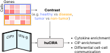

# huCIRA

[![Tests][badge-tests]][tests]
[![Documentation][badge-docs]][documentation]

[badge-tests]: https://img.shields.io/github/actions/workflow/status/theislab/cytokine_dict/test.yaml?branch=main
[badge-docs]: https://img.shields.io/readthedocs/cytokine_dict

huCIRA provides an easy-to-use interface to analyze cytokine signaling and cytokine-induced immune program enrichment in transcriptomic datasets.

To get started, simply supply a transcriptomic dataset annotated with immune cell types and the experimental conditions of interest. Using our dictionary as a reference, huCIRA allows you to infer differential cytokine activity and immune program activation across conditions and to map cytokine-mediated interactions between immune cells. Under the hood, huCIRA is based on [gseapy](https://github.com/zqfang/GSEApy/tree/master/gseapy) to run enrichment analyses.





## Getting started

Please refer to the [documentation][],
in particular, the [API documentation][].

## Installation

You need to have 3.11 <= Python < 3.14 installed on your system. 
If you don't have Python installed, we recommend installing [uv][].

There are several alternative options to install cytokine_dict:

<!--
1) Install the latest release of `cytokine_dict` from [PyPI][]:

```bash
pip install cytokine_dict
```
-->

1. Install the latest development version:

```bash
pip install git+https://github.com/theislab/cytokine_dict.git@main
```

## Release notes

See the [changelog][].

## Contact

If you found a bug, please use the [issue tracker][].

## Citation

> t.b.a

[uv]: https://github.com/astral-sh/uv
[scverse discourse]: https://discourse.scverse.org/
[issue tracker]: https://github.com/theislab/cytokine_dict/issues
[tests]: https://github.com/theislab/cytokine_dict/actions/workflows/test.yaml
[documentation]: https://cytokine_dict.readthedocs.io
[changelog]: https://cytokine_dict.readthedocs.io/en/latest/changelog.html
[api documentation]: https://cytokine_dict.readthedocs.io/en/latest/api.html
[pypi]: https://pypi.org/project/cytokine_dict
